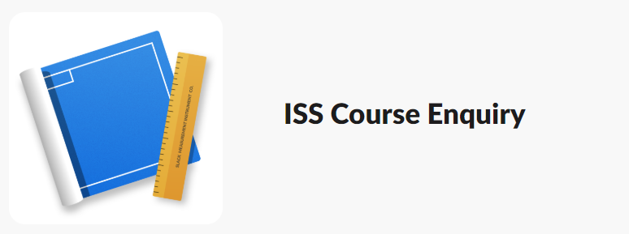

## SECTION 1 : PROJECT TITLE
## 4M1L - ISS Enquiry Chat Bot

---
## SECTION 2 : EXECUTIVE SUMMARY / PAPER ABSTRACT
The evolution of artificial intelligence has became a hot topic in the recent year. While comparing between artificial intelligence and chatbots, chatbots are only a faint splash on a huge wave of progress. In the recent days, the number of users of social media messaging apps like Slack, Whatsapps, Telegrama and Skype are skyrocketing,  Facebook Messenger alone has achieved the milestone of 1.2 billion monthly users. With the increasing of popularity of messaging apps, virtual chatbots that imitate human conversations for solving various tasks are becoming a trend and is an inevitable process to move towards an advanced society. Chinese WeChat bots nowadays provide a fancy function to minimize the repetitive process, such as setting medical appointments, calling a taxi, sending money to friends, check in for a flight and so on.

When come to the sector of automating customer support, online chatbots will come in handy to save time and more efficient. Gartner forecasts that by 2020, over 85% of customer interactions will be handled without a human. However, the advantages provided by chatbot systems exceeded the expectation of an ordinary system that give responses to customers’ inquiries. They also provide function such as collecting information about users, reducing overhead costs and helping to organize meetings. It is undoubtedly that size of the chatbot market is growing exponentially.

Looking at the current website of ISS, there is still a big improvement that could be made to help our next batch of student in better understanding the ISS programme. Our team has applied the techniques learned in class and scraped the information from the existing website to develop a chatbot. By utilizing the Dialogflow and Slack, it saves us the time to develop the backend and frontend yet achieving the optimized result. It will definitely be a good news for ISS applicants if the chatbot is successfully implemented in the ISS website.

---
## SECTION 3 : CREDITS / PROJECT CONTRIBUTION

| Official Full Name  | Student ID (MTech Applicable)  | Work Items (Who Did What) | Email (Optional) |
| :------------ |:---------------:| :-----| :-----|
| Chen Liwei | A0101217B | Knowledge Acquisition, Video Editing, Report Writing | e0384319@u.nus.edu |
| Lee Boon Kien | A0195175W | Video Presentation, Report Writing | e0384806@u.nus.edu |
| Ng Cheong Hong| A0195290Y| Knowledge Modelling, Programmer | e0384921@u.nus.edu |
| Raymond Djajalaksana| A0195381X | Knowledge Acquisition, Report Writing, Programmer | e0385012@u.nus.edu |
| Seah Jun Ru| A0097451Y | Report Writing, Programmer | e0258166@u.nus.edu |

---
## SECTION 4 : VIDEO OF SYSTEM MODELLING & USE CASE DEMO

---
## SECTION 5 : USER GUIDE

#### Requirements
- You just need to create account to our chatbot workspace. To create new account simply use this invitation link:
https://join.slack.com/t/iss4m1l/shared_invite/enQtNjM5MzgzMTQ4NDM3LTcxZjM1ZGZlM2VkYzVjZGY4OTU4NDcxYTkyMDViNTFhYjVmMDRmZWNhYjFlMjNlZDM5NGFhODEyN2E0MDNkOTE
- If you already have the account you can try login from here :
https://iss4m1l.slack.com/

- Join public channel *#iss-course-enquiry* or simply browse ISS Course Enquiry app.

#### User Guide
`4M1L_User_Guide_ECB.pdf` : <https://github.com/raycap/IRS-RS-2019-04-27-IS1PT-GRP-4M1L-CB/blob/master/UserGuide/4M1L_User_Guide_ECB.pdf>

---
## SECTION 6 : PROJECT REPORT / PAPER
`4M1L_ISSEnquiryChatBotReport.pdf` : <https://github.com/raycap/IRS-RS-2019-04-27-IS1PT-GRP-4M1L-CB/blob/master/ProjectReport/4M1L_ISSEnquiryChatBotReport.pdf>

---

**This [Cognitive Systems (CS)](https://www.iss.nus.edu.sg/executive-education/course/detail/cognitive-systems "Cognitive Systems") course is part of the Analytics and Intelligent Systems and Graduate Certificate in [Intelligent Reasoning Systems (IRS)](https://www.iss.nus.edu.sg/stackable-certificate-programmes/intelligent-systems "Intelligent Reasoning Systems") series offered by [NUS-ISS](https://www.iss.nus.edu.sg "Institute of Systems Science, National University of Singapore").**

**Lecturer: [FAN Zhen Zhen](https://www.iss.nus.edu.sg/about-us/staff/detail/278/FAN%20Zhen%20Zhen "FAN Zhen Zhen")**

